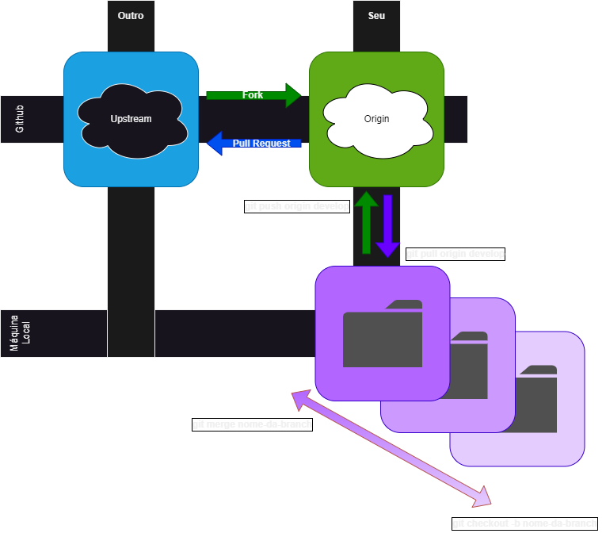

# **4 em Linha FRONTEND**

## **SUMARIO**

- **[Github](#github)**
  - [Contextualizando](#contextualizando)
  - [Clonando o projeto na sua máquina local](#clonando-o-projeto-na-sua-máquina-local)
- **[Getting Started with Create React App](#getting-started-with-create-react-app)**
  - [Se for sua primeira vez com o projeto na sua máquina](#se-for-sua-primeira-vez-com-o-projeto-na-sua-máquina)
  - [Available Scripts](#available-scripts)
  - [Learn More](#learn-more)

***

# **Github**



## **Como contribuir com um projeto no GitHub**

- [Acesse informações em um site mais decritivo!](https://docs.github.com/pt/get-started/quickstart/contributing-to-projects)

- O site do GitHub é o que podemos chamamr de **remoto** e a sua máquina de **local**.
- **Upstream** é o repositório (projeto) de um usuário o qual se deseja contribuir.
- Ao acessar este repositório (Upstream) e realizar um **fork**, você cria uma "cópia" no seu perfil lá no github.
  - isso é feito para que, se você fizer alterações no projeto, possa "subir" essas alterações para seu perfil ao invés de diretamente para o projeto "original", eai sim, em seguida, abrir um pedido de **pull request**, o qual será avaliado pelo dono do projeto para definir se será aceito ou não.

## **Clonando o projeto na sua máquina local**

- Caminhe na sua máquina local até o local onde se deseja "baixar" o repositório do site do [github](https://www.alura.com.br/artigos/o-que-e-git-github?utm_term=&utm_campaign=%5BSearch%5D+%5BPerformance%5D+-+Dynamic+Search+Ads+-+Artigos+e+Conte%C3%BAdos&utm_source=adwords&utm_medium=ppc&hsa_acc=7964138385&hsa_cam=11384329873&hsa_grp=111087461203&hsa_ad=645853715422&hsa_src=g&hsa_tgt=aud-1059365955554:dsa-843358956400&hsa_kw=&hsa_mt=&hsa_net=adwords&hsa_ver=3&gclid=CjwKCAjw3dCnBhBCEiwAVvLcu6JoV2OULEYAIy51HwaPI-YzwU01JDYfmyrNyasLaMrobBmMV55FuhoC6nYQAvD_BwE), abra a pasta em um terminal e digite ```git init```.
  - isso irá inicializar o [git](https://www.alura.com.br/artigos/o-que-e-git-github?utm_term=&utm_campaign=%5BSearch%5D+%5BPerformance%5D+-+Dynamic+Search+Ads+-+Artigos+e+Conte%C3%BAdos&utm_source=adwords&utm_medium=ppc&hsa_acc=7964138385&hsa_cam=11384329873&hsa_grp=111087461203&hsa_ad=645853715422&hsa_src=g&hsa_tgt=aud-1059365955554:dsa-843358956400&hsa_kw=&hsa_mt=&hsa_net=adwords&hsa_ver=3&gclid=CjwKCAjw3dCnBhBCEiwAVvLcu6JoV2OULEYAIy51HwaPI-YzwU01JDYfmyrNyasLaMrobBmMV55FuhoC6nYQAvD_BwE) na sua pasta
- Para configurar seu usuário e e-mail digite:
  - ```git config user.name seu-usuario```
  - ```git config user.email seu-email```
- Para "baixar" o repositório do seu perfil no github na sua máquina e criar uma conexão com ela, para que se possa atualizar o código no github, digita-se o código ```git clone url-do-repositorio```
- **[clique aqui para mais informações..](https://docs.github.com/pt/repositories/creating-and-managing-repositories/cloning-a-repository)**
- SEMPRE USE NO MÁXIMO A BRANCH DEVELOP (para fazer pull, push e criar nova branch) 
  - Para saber em que branch está: ```git branch```
  - É possível renomear o nome da branch..
  - Para criar uma branch a partir da branch atual em que se encontra: ```git checkout -b nome-da-branch-nova```
  - Para juntar a branch nova na branch original:
    - Para ir para branch original (ou qualquer outra): ```git checkout nome-da-branch-original```
    - Para juntar: ```git merge nome-da-branch-nova```
    - Prestar atenção se há conflito na junção..
  - **A partir da branch develop, cria uma branch com seu nome para trabalhar**
- Após realizar as alterações desejadas e ter feito o merge, realize a "subida" (para o repositório no git hub): ```git push origin nome-da-branch```
- Após ter "subido" as alterações, solicite um pull request para o repositório do projeto original do usuário dono.

***

# **Getting Started with Create React App**

This project was bootstrapped with [Create React App](https://github.com/facebook/create-react-app).

## **Se for sua primeira vez com o projeto na sua máquina**

- Rodar no terminal: ```npm install```

## Available Scripts

In the project directory, you can run:

### `npm start`

Runs the app in the development mode.\
Open [http://localhost:3000](http://localhost:3000) to view it in your browser.

The page will reload when you make changes.\
You may also see any lint errors in the console.

### `npm test`

Launches the test runner in the interactive watch mode.\
See the section about [running tests](https://facebook.github.io/create-react-app/docs/running-tests) for more information.

### `npm run build`

Builds the app for production to the `build` folder.\
It correctly bundles React in production mode and optimizes the build for the best performance.

The build is minified and the filenames include the hashes.\
Your app is ready to be deployed!

See the section about [deployment](https://facebook.github.io/create-react-app/docs/deployment) for more information.

### `npm run eject`

**Note: this is a one-way operation. Once you `eject`, you can't go back!**

If you aren't satisfied with the build tool and configuration choices, you can `eject` at any time. This command will remove the single build dependency from your project.

Instead, it will copy all the configuration files and the transitive dependencies (webpack, Babel, ESLint, etc) right into your project so you have full control over them. All of the commands except `eject` will still work, but they will point to the copied scripts so you can tweak them. At this point you're on your own.

You don't have to ever use `eject`. The curated feature set is suitable for small and middle deployments, and you shouldn't feel obligated to use this feature. However we understand that this tool wouldn't be useful if you couldn't customize it when you are ready for it.

## **Learn More**

You can learn more in the [Create React App documentation](https://facebook.github.io/create-react-app/docs/getting-started).

To learn React, check out the [React documentation](https://reactjs.org/).

### **Code Splitting**

This section has moved here: [https://facebook.github.io/create-react-app/docs/code-splitting](https://facebook.github.io/create-react-app/docs/code-splitting)

### **Analyzing the Bundle Size**

This section has moved here: [https://facebook.github.io/create-react-app/docs/analyzing-the-bundle-size](https://facebook.github.io/create-react-app/docs/analyzing-the-bundle-size)

### **Making a Progressive Web App**

This section has moved here: [https://facebook.github.io/create-react-app/docs/making-a-progressive-web-app](https://facebook.github.io/create-react-app/docs/making-a-progressive-web-app)

### **Advanced Configuration**

This section has moved here: [https://facebook.github.io/create-react-app/docs/advanced-configuration](https://facebook.github.io/create-react-app/docs/advanced-configuration)

### **Deployment**

This section has moved here: [https://facebook.github.io/create-react-app/docs/deployment](https://facebook.github.io/create-react-app/docs/deployment)

### `npm run build` fails to minify

This section has moved here: [https://facebook.github.io/create-react-app/docs/troubleshooting#npm-run-build-fails-to-minify](https://facebook.github.io/create-react-app/docs/troubleshooting#npm-run-build-fails-to-minify)